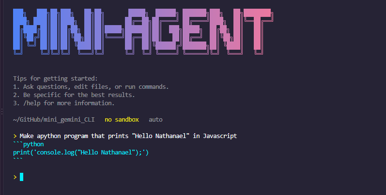

# mini-agent

A miniature terminal-based AI coding agent, built from scratch in TypeScript to understand how tools like [Gemini CLI](https://github.com/google-gemini/gemini-cli) actually work under the hood — agent loops, tool calling, permissions, context management — before contributing to the real thing.

This isn't meant to compete with Gemini CLI. It's a deliberately small reimplementation of its core ideas, built one concept at a time, so that reading the real codebase later feels like recognizing familiar patterns instead of decoding unfamiliar architecture.

## Why this exists

Gemini CLI is much more than "a CLI that sends prompts to Gemini" — it's an agent runtime with a tool system, context management, and a permission/scheduling layer. This project rebuilds a simplified version of each of those pieces, in order, to build real intuition before attempting a contribution to the upstream project.

## Features

- **Conversational REPL** — persistent multi-turn chat with history, not a one-shot script
- **Tool calling** — the model can request `read_file`, `list_directory`, `write_file`, and `run_command` instead of only returning text
- **Agent loop** — the model can chain multiple tool calls autonomously (read → test → edit → test) up to a configurable step limit, rather than one round-trip per message
- **Permission system** — destructive tools (`write_file`, `run_command`) require explicit `y/N` confirmation before executing
- **Context compression** — once conversation history crosses a token threshold, older turns are summarized by the model itself and replaced with a condensed turn, keeping the most recent turns intact
- **Slash commands** — `/help`, `/tools`, `/history`, `/clear`, `/exit`
- **CLI arguments** — supports both an interactive REPL (`mini-agent`) and one-shot mode (`mini-agent "message"`, `mini-agent --file src/app.ts "review this"`)
- **Colored terminal output** — tool calls, prompts, and permission warnings are visually distinct via ANSI colors

## Architecture

```
src/
├── cli.ts                 # Entry point: arg parsing, REPL loop, agent loop
├── types.ts                # Shared ChatMessage type
├── commads.ts               # Slash command handling
├── permisson.ts              # Permission gating for dangerous tools
├── context/
│   ├── compress.ts          # History summarization when token estimate is high
│   └── tokenEstimate.ts     # Rough token count heuristic
├── tools/
│   ├── registry.ts          # Tool declarations + dispatcher
│   ├── readFile.ts
│   ├── listDirectory.ts
│   ├── writeFile.ts
│   └── shell.ts              # run_command
└── ui/
    └── colors.ts             # ANSI color helpers
```

### The agent loop

The core mental model this project is built around:

```
User input
   ↓
Model (Gemini)
   ↓
Text?  → print and stop
   │
Tool call? → check permission → execute → feed result back to model → repeat
                                                                (up to MAX_AGENT_STEPS)
```

Every tool call and its result is appended to conversation history, so the model always has full visibility into what it already tried and what happened — including permission denials and failed shell commands, which are returned as tool results rather than thrown as errors.

## Setup

```bash
git clone <this-repo>
cd mini-agent
npm install
```

Create a `.env` file in the project root:

```
GEMINI_API_KEY=your_key_here
```

Get a free API key at [Google AI Studio](https://aistudio.google.com).

## Usage

**Interactive REPL:**
```bash
npm start
```

**One-shot mode:**
```bash
npm start -- "Explain binary search"
```

**With a file injected as context:**
```bash
npm start -- --file package.json "What does this project depend on?"
```

**Slash commands (inside the REPL):**
```
/help      Show available commands
/tools     List available tools
/history   Show conversation turn count
/clear     Reset conversation history
/exit      Quit
```

## Tech stack

- **Node.js** + **TypeScript**
- [`@google/genai`](https://www.npmjs.com/package/@google/genai) — official Gemini API SDK
- `tsx` for direct TypeScript execution during development
- `dotenv` for API key management
- No framework — deliberately hand-rolled `readline` REPL, tool registry, and agent loop to keep every moving part visible

## What this project is not

- Not a replacement for Gemini CLI, and not trying to be
- No sandboxing beyond basic path-containment checks — this runs with your real filesystem and shell access, gated only by manual `y/N` prompts
- No streaming responses yet
- No real tokenizer — context compression uses a rough word-count heuristic, not exact token counts
- No loop detection beyond a hard step cap

## Roadmap / possible next steps

- [ ] Streaming responses instead of waiting for full completions
- [ ] Real tokenizer-based context management instead of word-count estimation
- [ ] Loop detection (catching repeated read/edit/test cycles, not just capping total steps)
- [ ] More tools (`edit_file` with diffs instead of full overwrites, `search_files`)
- [ ] Use this understanding to find and submit a scoped contribution to [google-gemini/gemini-cli](https://github.com/google-gemini/gemini-cli)

## Background

Built as a structured learning project, working through Gemini CLI's real architecture (`GeminiClient`, `Turn`, tool scheduler, `ChatCompressionService`, `LoopDetectionService`) and re-implementing simplified versions of each concept independently rather than copying the source, in order to genuinely understand *why* each piece exists.
